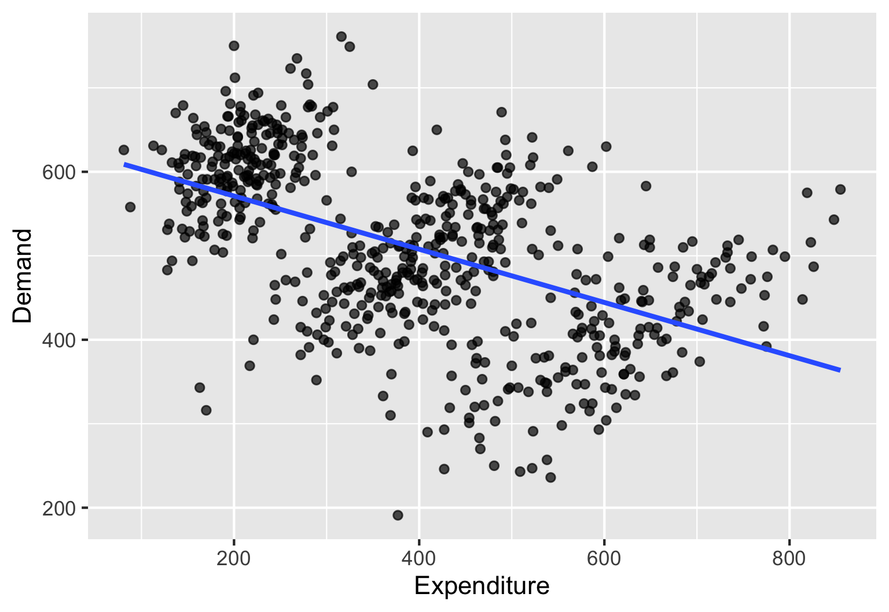
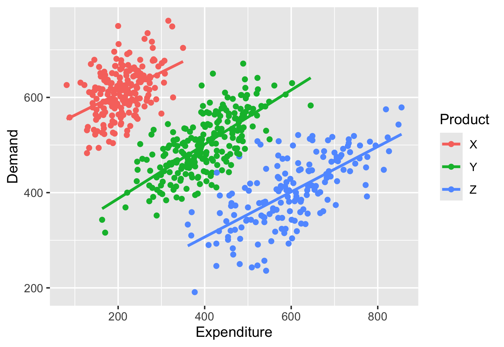

# Adjustment {#sec-adjustment}

At a high level, we use simple models for one of two purposes:

- reveal differences across groups
  - One model might tell us that the average weekly sales of product A are greater than that of product B. 
  - Another model might tell us that cars with front wheel drive have higher fuel efficiency than cars with rear, or four-wheel drive.
- reveal relationships between variables. 
  - A model might tell us that sales of a company are positively related to advertising expenditure.
  - A model might show us that the more time students spend on social media, the lower their GPA is.

Can models mislead? Can they ask us to believe something that is really not true? 

This chapter considers these important questions and sensitizes you to the important concept of *adjustment* that takes us beyond just crunching the numbers, and into thinking critically about them.

## Apples to apples comparisons

We first look at several concrete examples that teach us to be cautious when making comparisons.

### Who is the best store manager?

A company has many retail stores across the country. The VP of sales has announced that the store manager of the store with the highest sales will get a big bonus. @tab-store-sales shows the sales of the first six stores in the dataset.

```{r}
#| eval: false
store_sales |>
    head()
```

|store_id |store_manager_name | store_sales|
|:--------|:------------------|-----------:|
|S001     |Ava Patel          |     1879989|
|S002     |Liam Kim           |     2258457|
|S003     |Mia Garcia         |     2518618|
|S004     |Noah Nguyen        |     3842134|
|S005     |Emma Johnson       |     3176279|
|S006     |Ethan Singh        |     2629851|

: First six rows from the store sales dataset {#tbl-store-sales}

Since the store manager of the store with the highest sales will get a big bonus, we look at the sales of all stores and find that the top six stores by sales are as shown in @tab-top-sales.

```{r}
#| eval: false
store_sales |> 
  arrange(-store_sales) |> 
  head() 
```

|store_id |store_manager_name | store_sales|
|:--------|:------------------|-----------:|
|S030     |Sebastian Perez    |     4635738|
|S016     |James Gonzalez     |     4501858|
|S004     |Noah Nguyen        |     3842134|
|S033     |Zoey Allen         |     3530267|
|S036     |Samuel King        |     3424019|
|S014     |Elijah Hernandez   |     3278952|

: Top six stores by sales {#tbl-top-sales}

Should Sebastian Perez get the award?

::: {.callout-note icon=false}
## Quick Check {.unnumbered}

Under what conditions is comparing total sales in the stores a good or a poor basis for the award? What other variables might be relevant to consider in this comparison?
:::

::: {.callout-note icon=false collapse=true}
## Suggested answer {.unnumbered}

The best we can say is: **Other things being equal**, the store with the highest sales is likely to be the best managed. So, before concluding that Sebastian Perez is the best manager, we need to ask: Are the stores otherwise similar? If not, what are the differences and how do they affect sales?

Besides the quality of store management, other factors could affect the total sales in a store. For example:

- Size of the store
- economic condition of the neighborhood where the store is located
- kind of products they sell
:::


::: {.callout-important}
If the stores differ only in their floor area and are otherwise quite similar, we will get a better picture by **adjusting** the sales for store size. So instead of comparing sales volume, we could compare sales volume *per square foot*.

If we think there are other important factors playing a role, we should adjust for them as well.
:::

The data frame *store_sales_full*, has  *store_floor_area*. as an additional variable. See @tab-store-sales-full.

```{r}
#| eval: false
store_sales_full |> 
  head()
```

|store_id |store_manager_name | store_sales| store_floor_area|
|:--------|:------------------|-----------:|----------------:|
|S001     |Ava Patel          |     1879989|             4400|
|S002     |Liam Kim           |     2258457|             4800|
|S003     |Mia Garcia         |     2518618|             6600|
|S004     |Noah Nguyen        |     3842134|             5100|
|S005     |Emma Johnson       |     3176279|             5100|
|S006     |Ethan Singh        |     2629851|             6700|

: First six rows from the *store_sales_full* dataset showing each store's floor area as well{#tbl-store-sales-full}

Let us compute the sales per square foot for each store and then look at the top six stores by this metric. See @tab-top-sales-sqft.

```{r}
#| eval: false
store_sales_full |> 
  mutate(sales_per_sqft = store_sales/store_floor_area) |> 
  select(-store_id) |> 
  arrange(-sales_per_sqft) |> 
  head() 
```

|store_manager_name | store_sales| store_floor_area| sales_per_sqft|
|:------------------|-----------:|----------------:|--------------:|
|Noah Nguyen        |     3842134|             5100|            753|
|Sebastian Perez    |     4635738|             6300|            736|
|James Gonzalez     |     4501858|             6800|            662|
|Elijah Hernandez   |     3278952|             5100|            643|
|Emma Johnson       |     3176279|             5100|            623|
|Samuel King        |     3424019|             5700|            601|

: Top six stores by sales per square foot {#tbl-top-sales-sqft}

@tab-top-sales-sqft shows that Noah Nguyen has the highest sales per square foot. So, if we adjust for store size, Noah Nguyen would get the award instead of Sebastian Perez. Several of the stores in the top six from earlier (@tab-top-sales) do not figure in this list at all.

::: {.callout-note icon=false}
## Quick Check {.unnumbered}

The person who gathered the data realized that the floor area of the store that Sebastian manages was incorrectly shown as 6300 sqft. It is actually  7000 sqft. Does this change make it possible for Sebastian to regain the top spot based on the adjusted calculations?
:::

::: {.callout-note icon=false collapse=true}
## Suggested answer {.unnumbered}

No. With the same sales and a higher floor area, sebastian's sales per square foot would go down. This has the possible effect of moving him down the list, and it certainly does not help him regain the top spot.
:::

::: {.callout-note icon=false}
## Quick Check {.unnumbered}

What exactly did the adjustment do? Why was Sebastian the top performer earlier and why did that change after adjustment? Why did many others who were in the top six earlier not figure in the top six after adjustment?
:::

::: {.callout-note icon=false collapse=true}
## Suggested answer {.unnumbered}

Initially Sebastian seemed to be the top performer, but it turned out that he had an advantage in terms of store size. When we removed that advantage by comparing sales per square foot, a different picture emerged. SImilarly, many of the stores that were in the top six by total sales had relatively large floor areas, and when we adjusted for that, they did not figure in the top six by sales per square foot.
:::

::: {.callout-note icon=false}
## Quick Check {.unnumbered}

Under what conditions would we need to make even more adjustments?
:::

::: {.callout-note icon=false collapse=true}
## Suggested answer {.unnumbered}

Other than just the size, if the stores are similar in all respects, then we do not need to adjust for anything else. However, if there are other differences between the stores that we think might affect sales, then we should adjust for those as well. For example, if some stores are in more affluent neighborhoods than others, then we might want to adjust for neighborhood income level.

When we say *adjust for* we mean that we want to include that as an explanatory variable.
:::

### Bank branch loan default comparisons

A bank compares loan default rates across branches.

>Branch A: 8% default rate
>Branch B: 3% default rate

Conclusion: Branch A has weaker loan officers.

::: {.callout-note icon=false}
## Quick Check {.unnumbered}

What might we need to adjust for? What might be possible buried variables?
:::

::: {.callout-note icon=false collapse=true}
## Suggested answer {.unnumbered}

- Customer credit profile
- Neighborhood income level
- Type of loans issued
:::

::: {.callout-important}
Before jumping to conclusions based only on the default rate, We might need to **Adjust for** other variables.
:::

::: {.callout-tip}
Do you see a common theme emerging from these *comparison* situations showing the need for *adjustment*? 

When we compare different numbers that seem to show show superiority or inferiority, we should always wonder if the baseline or potential is different for the different numbers we are comparing. We can then take this into account (**adjust!**) in our comparison.

**Based on the examples, you should not assume that comparisons are never valid.** Indeed, many comparisons might be valid. We are only pointing out that we should examine this facet carefully before tacitly accepting the story that some numbers tell us.
:::

### Comparing students' GPAs

Daniel Kaplan, in "Lessons in statistics" presents a nice example of the need for *adjustment* that students can relate to. We use the same idea here.

At the end of their freshman semester, Susan has a GPA of 3.8, compared to Nolan's 3.45. The cutoff for a certain scholarship is 3.5. Susan qualifies to apply, Nolan does not. Assuming that the scholarship provide used the GPAs to identify *better* students, Under what conditions can we consider this comparison to be fair, and under what conditions would it be unfair? If the comparison is unfair, what can we do to perform a fair comparison?

::: {.callout-note icon=false}
## Quick Check {.unnumbered}

Describe one situation in which you would consider this comparison fair and one where you would consider this unfair.
:::

::: {.callout-note icon=false collapse=true}
## Suggested answer {.unnumbered}

Let us consider the *unfair* angle first. Suppose Susan took classes with professors who were easier graders than those with whom Nolan took classes. For example, in courses that Susan took, the average grade might have been 3.67. On the other hand, the average grade in the courses that Nolan took might have been 3.00. That would be a systematic difference between the two students' situations that we will miss if we used just the raw GPAs. 

If we can show that both Susan and Nolan had, on average, professors who graded equally easily across their courses, then the comparison of their GPAs would seem to be fair. 

Of course, we can think of many other reasons whereby both Susan and Nolan are equally *good* students and yet their GPA differs. For example, Nolan might have had ill-health or family issues that affected his performance.
:::

The suggested answer above tells us that comparing raw GPAs could be misleading and that we somehow need to temper the GPAs or *adjust* them to account for their professor's grading difficulty. That is, we should compute an adjusted GPA for Susan and Nolan and then compare them. Alternatively, the scholarship cutoff should be based on an adjusted GPA rather than the raw one.

The dataset *gpa_data_basic* has illustrative data for five students on four courses each.

```{r}
gpa_data_basic
```

Based on the above data, we can compute the GPA for the students and list them in descending order. See @tab-gpa-basic.

```{r}
#| eval: false
gpa_data_basic |> 
  summarize(gpa = mean(grade_points), .by = student_id) |> 
  arrange(-gpa)
```

|student_id |  gpa|
|:----------|----:|
|S01        | 3.58|
|S02        | 3.42|
|S03        | 3.00|
|S05        | 3.00|
|S04        | 2.50|

: Students arranged in non-ascending order of GPA based on raw grades {#tbl-gpa-basic}

The data frame *gpa_data_adjusted* shows the student data with an additional variable showing the corresponding professor's grading toughness in the range 0.75 (very tough grader) to 1.25 (very easy grader. See @tab-grade-data-adjusted.

```{r}
gpa_data_adjusted
```

The variable *adjusted_points* shows the grade points for each student for each course adjusted with the professor's grading toughness (raw grade point divided by grading toughness).

::: {.callout-note icon=false}
## Quick Check {.unnumbered}

Explain why the adjusted points in the first row is 2.94. 
:::

::: {.callout-note icon=false collapse=true}
## Suggested answer {.unnumbered}

The raw grade point for the first row is 3.67. The corresponding professor's toughness is 1.25. The adjusted points is computed as 3.67/1.25 = 2.94. The same applies to all rows in the data frame.
:::

Using this data, we can now compute the adjusted gpa. See @tab-gpa-adjusted

```{r}
#| eval: false
gpa_data_adjusted |> 
  summarize(adj_gpa = mean(adjusted_points), .by = student_id) |> 
  arrange(-adj_gpa)
```

|student_id | adj_gpa|
|:----------|-------:|
|S03        |    3.77|
|S02        |    3.42|
|S04        |    3.15|
|S05        |    2.95|
|S01        |    2.93|

: GPA of students based on adjusted grades {#tbl-gpa-adjusted}


When comparing @tab-gpa-basic and @tab-gpa-adjusted, we see that the order of students has changed. Student S01, who had the highest raw GPA, has the lowest adjusted GPA. Student S03, who had a raw GPA of 3.00, has the highest adjusted GPA of 3.77.

::: {.callout-note icon=false}
## Quick Check {.unnumbered}

Students S03 and S05 had a raw GPA of 3.0. But the adjusted GPA for S03 went up to 3.77 and that for S05 went down to 2.95. Why this difference?
:::

::: {.callout-note icon=false collapse=true}
## Suggested answer {.unnumbered}

They took courses with different instructors with different grading toughness. S03 took courses with tougher graders than S05.
:::

::: {.callout-important}
Instead of comparing GPAs directly, we need to **adjust** them for grading toughness of professors to get a more accurate picture of the students' performance.
:::

### Gender pay gap?

An employee sues a company for pay discrimination based on the following data:

>Average male salary: $110,000
>Average female salary: $95,000

It could be true that the company is systematically paying female employees lower salaries. Or could it be the case that the company is not discriminating against female employees. *Could it even be the case that the company is systematically paying its male employees lower salaries?*

What should we examine before concluding? What important variables might we be missing?

What if:

- the company had mostly male employees for a long time and is trying to bridge this gap and has been recruiting more female employees in recent years, but more of these recruits have been at lower levels -- resulting in lower average salaries for female employees?

- the job roles differ significantly between male and female employees? For example, the company may have many people who operate heavy equipment and are paid very high salaries because of the risk involved. All of these operators are male and this could raise the average male pay.

::: {.callout-important}
- It could turn out that when we adjust for the right variables, the difference vanishes. 

- It could even be that when we compare male and female workers performing similar tasks or at similar job levels (**adjust for the variables job level and job type**) *the data could even possibly reveal that the company is actually underpaying male employees!* ... despite the overall average seemingly showing the opposite.

The only way to get to the truth is to **adjust** for the right variables and then compare.
:::

::: {.callout-important}
We spoke earlier about baseline potential being different for the numbers being compared. Such differences arise from **systematic** differences between the groups being compared. 

- In the case of the store managers, we initially attributed the difference in sales across stores solely to how effectively the stores were being managed. But that might not be the only difference. Stores might differ in other ways that the initial analysis has not considered -- for example, store size.

- In the bank loan default scenario, if we attributed the differences in default rates solely to the efficiency of the loan officers then we assume that the branches are otherwise the same. When we see how there might be other differences, then we get a more nuanced picture.

- In the GPA example, we initially attributed the GPA differences solely to the *quality* of the students. However, when we take into account other important differences -- like the differences in toUghness of grading across professors, a different picture emerges.

- In the pay discrimination example, we initially attributed the pay difference solely to gender, ignoring other relevant systematic differences between the two groups.
:::

## We might need adjustment to properly understand relationships

The previous section showed the importance of adjustment when comparing summaries across groups. In this section, we will see that adjustment is also important when we are trying to understand relationships between variables.

### Simpson's paradox

The data frame *demand_expenditure_simpson* has data on demand and expenditure for a company. We can build a model to understand the relationship between demand and expenditure.

```{r}
demand_expenditure_simpson |> 
  model_train(Demand ~ Expenditure) |> 
  coef()
```

The output shows, counterintuitively, that the coefficient of *Expenditure* is negative. See @eq-simpson-overall. The model suggests that increasing expenditure by one unit *decreases* demand by 0.32 units.
$$
\widehat{Demand} = 634.6 - 0.32 \times Expenditure
$$ {#eq-simpson-overall}

@fig-simpson-overall confirms this.

```{r}
#| eval: false
demand_expenditure_simpson |> 
  point_plot(Demand ~ Expenditure, 
             annot = "model",
             interval = "none")
```


{#fig-simpson-overall width=70% fig-align=center}

While the overall relationship is puzzling, we can see that the plot itself shows three distinct clouds of points. This might lead us to wonder if there is a variable we might be missing.

The data frame *demand_expenditure_simpson* has a variable *Product*. Perhaps that has something to do with this counter-intuitive finding. 

Let us *adjust* for product by including it in the model. 

```{r}
demand_expenditure_simpson |> 
  model_train(Demand ~ Expenditure + Product) |> 
  coef()
```

We see now that the coefficient of *Expenditure* is positive, showing that higher expenditure is associated with higher demand. See the model function in @eq-simpson-adjusted.

$$
\widehat{Demand} = 505.5 + 0.51 \times Expenditure
\begin{cases}
+\,0 & \text{if } \text{Product} = \text{"ProductX"} \\
-\,207.6 & \text{if } \text{Product} = \text{"ProductY"} \\
-\,409 & \text{if } \text{Product} = \text{"ProductZ"}
\end{cases}
$$ {#eq-simpson-adjusted}

Plotting three separate regression lines for the three products confirms this finding. See @fig-simpson-adjusted.

{#fig-simpson-adjusted width=70% fig-align=center}

::: {.callout-note icon=false}
## Quick Check {.unnumbered}

In the above example, why did the overall data give us an incorrect picture of the effect of advertising on sales?
:::

::: {.callout-note icon=false collapse=true}
## Suggested answer {.unnumbered}

The data for the three products were such that product Z had the highest expenditures and the lowest demands, product Y had the next highest expenditures and the next lowest demands, and product X had the lowest expenditures and the highest demands. This created a situation where the overall data showed a negative relationship between expenditure and demand, even though within each product, there was a positive relationship.

There was a systematic difference in the baseline demand for the three products, and this created a situation where the overall relationship was misleading. When we adjusted for product, we were able to see the true positive relationship between expenditure and demand within each product.
:::

## A word of caution about our examples

We showed some dramatic examples to illustrate the importance of adjustment. We do not mean to suggest that all comparisons of averages or of relationships are misleading or will have sweeping effects when we adjust for other variables. 

However, we do want to stress that we should always be cautious and ask ourselves if there are other variables that we need to adjust for before accepting the story that the numbers are telling us. 


