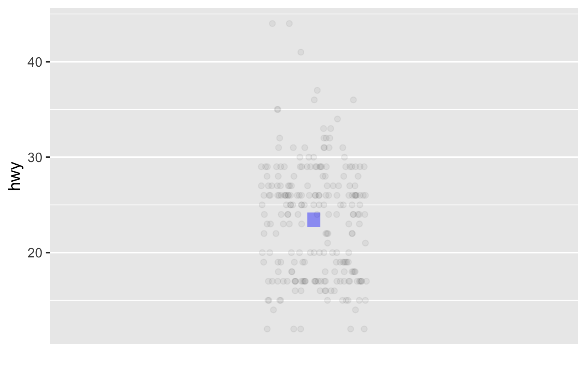
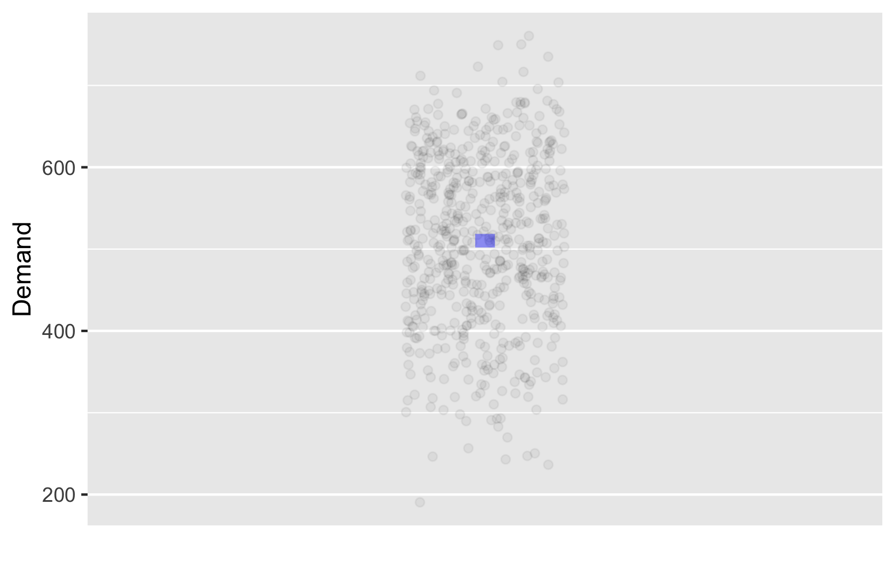
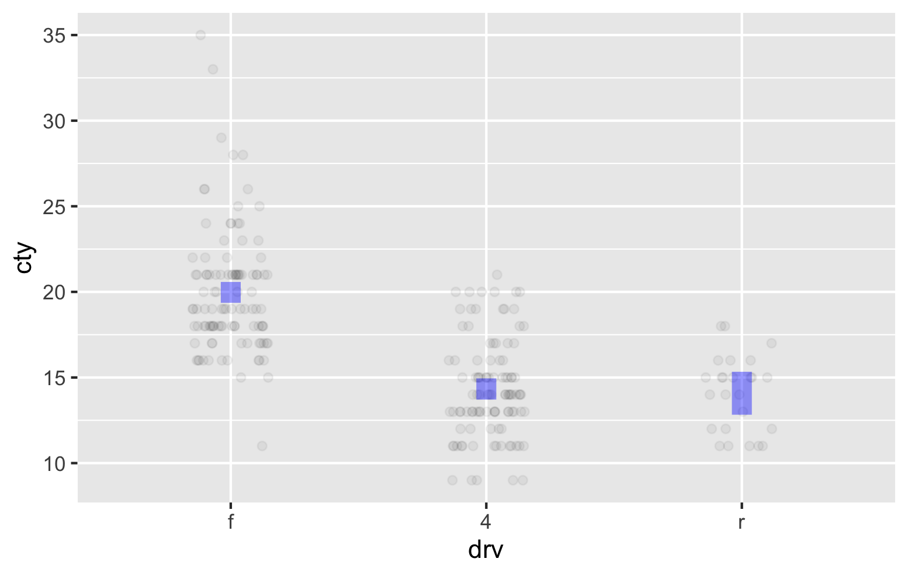
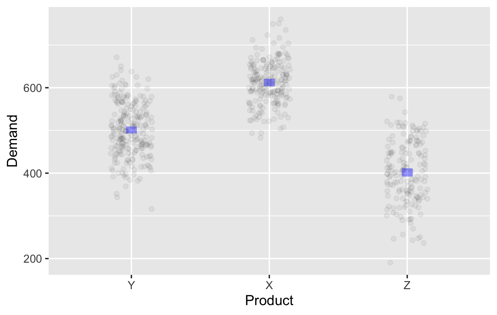
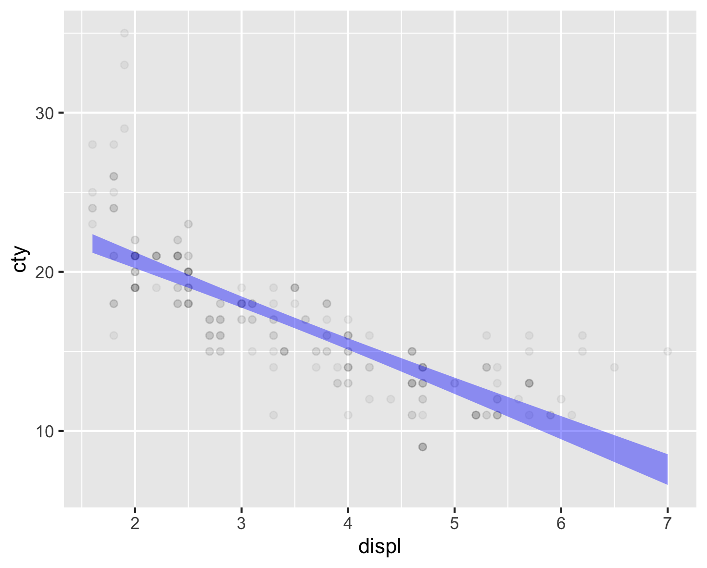

# Visualizing models and Computing Confidence Intervals {#sec-ci-compute-visualize}

In the previous chapter we discussed making inferences about the population mean based on just the sample mean.

We saw that while we cannot use the sample mean as the exact value of the population mean, we can specify an interval that we are 95% confident contains the population mean -- a confidence interval.

The mean as a model has no explanatory variables.

In this chapter we will see several examples and extend the idea to models that have one or two explanatory variables. We will also visualize each of them.

## Visualizing model uncertainty and computing the confidence intervals for mean models

We first consider our simplest mean models and visualize and compute confidence intervals for them.

### Visualizing mean models with uncertainty

In an earlier chapter, we had visualized mean models based solely on the dataset without considering that it was a sample, and hence uncertain. Now we consider two examples of visualizing it with uncertainty. 

We first visualize the model for highway mileage without any explanatory variables from the *mpg* data frame. Earlier we had used *interval = "none"*, because we were not considering the uncertainty arising from using a sample. At that time we only wanted a simple estimate and not an interval.

```{r}
#| eval: false
# Note no interval = "none" now
 mpg |> 
   point_plot(hwy ~ 1,
              annot = "model",
              point_ink = 0.05)
```

{#fig-hwy-band-model width=70% fig-align=center}

The model annotation now is a vertical band spanning the confidence interval for the mean -- it seems to be approximately {22, 24}. We cannot make out the precise lower and upper limits from the plot. We will compute the exact values in the next section.

This tells us, based on just a single sample, that we are 95% confident that the average highway mileage across all cars lies between 22 and 24 miles per gallon. 

Another way to say this is "if we took many different samples from the population and computed the confidence interval for each of them, then 95% of those intervals would contain the true population mean".

Next we use the *exp_demand* data frame and visualize the model for demand as the outcome variable, with no explanatory variable.

```{r}
#| eval: false
 exp_demand |> 
   point_plot(Demand ~ 1,
              annot = "model",
              point_ink = 0.05)
```


@fig-demand-band-model shows the raw data as points, along with the model annotation. 

{#fig-demand-band-model width=70% fig-align=center}


@fig-demand-band-model shows the raw data as points along with the model annotation. The model annotation now is a vertical band spanning the confidence interval. Again, we cannot see the precise upper and lower limits from the plot. From this, we can say that we are 95% confident that the average demand across all products lies roughly between 500 and 520.

Once again we see that although a single sample cannot help us to infer anything exact about a population, it can give us useful information about a much larger population.

### Computing confidence intervals for mean models

Using the *mpg* data frame, we build a model for the highway mileage without any explanatory variables and use the *conf_interval* function to see the model coefficient and its 95% confidence interval.

```{r}
mpg |> 
   model_train(hwy ~ 1) |> 
   conf_interval()
```

This says that our best estimate based only on the sample is 23.4. However, we cannot directly use this as the mean of the population. We can only be 95% confident that the population mean lies within the confidence interval {22.7, 24.2}. Put differently, any value in the range {22.7, 24.2} is equally good as an estimate of the population mean.

This confidence interval matches the one shown in @fig-hwy-band-model.

Once again, if we took many samples and computed the confidence interval for each one, then 95% of those intervals will contain the true population mean.

Next, using the *exp_demand* data frame, we build a model for estimating the demand based on no explanatory variables.

```{r}
exp_demand |> 
   model_train(Demand ~ 1) |> 
   conf_interval()
```

We see that the best estimate based on the sample is 510. The 95% confidence interval is {502, 519} and it matches @fig-demand-band-model.

## Visualizing and computing confidence intervals for category mean models

After looking at models without explanatory variables, let us look at models with a single categorical explanatory variable.

### Visualizing category mean models with uncertainty

We first look at the model for city mileage as the outcome variable with fuel type as the explanatory variable from the *mpg* data frame.

```{r}
#| eval: false
mpg |> 
  point_plot(cty ~ fl,
             annot = "model",
             point_ink = 0.05)
```

{#fig-cty-drv-band-model width=70% fig-align=center}

@fig-cty-drv-band-model shows the mean city mileage for each kind of drive as a band or range, visually representing the confidence interval for the city mileage for each kind of drive.

::: {.callout-note icon=false}
## Quick Check {.unnumbered}

The model band for front wheel drive cars seems to stretch between approximately 19 and 21. What does this say about the population?
:::

::: {.callout-note icon=false collapse=true}
## Suggested answer {.unnumbered}

It says that if we took all the front-wheel drive cars in the population, we can be 95% confident that the average city mileage across all of them would lie between 19 and 21 miles per gallon.
:::

Once again, if we took many samples and computed the confidence interval for the front wheel drive cars in each sample, then 95% of those intervals would contain the true population mean for the front wheel drive cars.

We now visualize the model for demand as the outcome variable with product as the explanatory variable from the *exp_demand* data frame.

```{r}
#| eval: false
exp_demand |> 
  point_plot(Demand ~ Product,
             annot = "model",
             point_ink = 0.05)
```

{#fig-demand-product-band width=70% fig-align=center}

Once again, the plot shows the confidence interval for the mean demand for each product.

::: {.callout-note icon=false}
## Quick Check {.unnumbered}

We see that the confidence interval for product X is approximately 600 to 625. What does this mean?
:::

::: {.callout-note icon=false collapse=true}
## Suggested answer {.unnumbered}

It means that we are 95% confident that the average demand across all products of type X in the population lies between 600 and 625.
:::

We now move on to computing these confidence intervals.

### Computing confidence intervals for category mean models

This is a bit tricky, and this course does not require you to know how to do this. You do need to know what exactly these intervals mean.However, we will show you how to do it in case you are interested.

Using the *mpg* data frame, we build a model for the city mileage with drive type as the explanatory variable.

```{r}
## Warning -- this code is not really useful for
## the confidence intervals for the coefficient for drv in this model
mpg |> 
  model_train(cty ~ drv) |> 
  conf_interval()
```

As we had discussed earlier, the model uses one level of the categorical explanatory variable as the base and provides the other values with respect to the base. In this case it has used drv = 4 as the base and shows the values coefficients for the other levels relative to the base. The confidence intervals for the other two drives are actually confidence intervals for the difference between the city mileage for those drive types and the city mileage for the front wheel drive cars. Therefore they are not directly useful for knowing the confidence intervals for those drive types independently.

We show below how to compute the confidence intervals separately for each drive type. We will use the *predict* function to do this. We will specify the new data for which we want to compute the confidence intervals, and also specify that we want confidence intervals.

```{r}
# You need not learn this code
mpg |>
  model_train(cty ~ drv) |> 
  predict(newdata = 
          data.frame(drv = c("4", "f", "r")),
          interval = "confidence")
```

Each row shows the model value and the confidence interval for one drive. The order is as per out code. The first column shows the model value and the second and third columns show the lower and upper limits of the confidence interval.

### Visualizing Confidence intervals for models with a single numerical explanatory variable

Next we look at the model for city mileage as the outcome variable with engine displacement as the explanatory variable from the *mpg* data frame.

```{r}
#| eval: false
# Note that we have not specified interval = "none" here,
# so we get the confidence interval instead of just a 
# line for the model
mpg |> 
  point_plot(cty ~ displ, 
             annot = "model", 
             point_ink = 0.05)
```

{#fig-cty-displ-band-model width=70% fig-align=center}

@fig-cty-displ-band-model shows the model for city mileage as a function of engine displacement. The model annotation is a band that shows the confidence interval for the estimated city mileage for each value of engine displacement.

When we visualized the same model earlier without the confidence interval, the model was just a line.

Now that we acknowledge that we based the model only on a sample and need to account for some uncertainty when we infer the model for the population, we do not get a line and instead have a band.

How do we interpret this confidence interval?

If we took many samples and built the band model for each one, then 95% of those bands will contain the l;ine that we will get if we used the entire population.

Therefore, we can say that we are 95% confident that the true population line lies somewhere within the band that we obtained from a single sample.