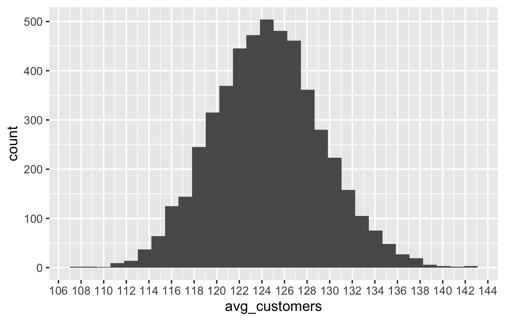
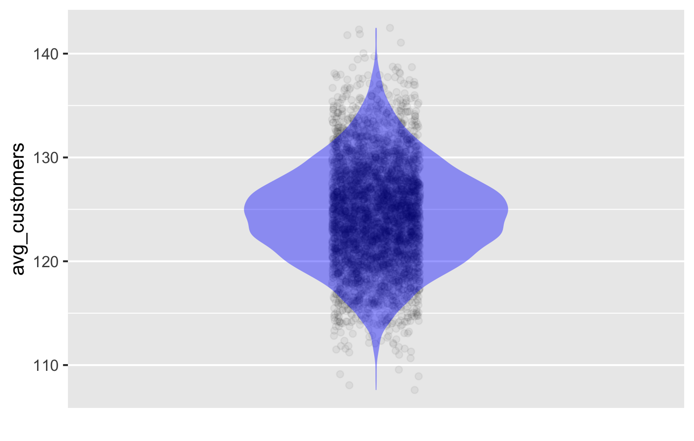

# Inference Based on a Single Sample {#sec-sampling-distributions}

In the previous chapter, we learned the distinction between populations and samples. We dabbled with the idea that even though a sample is a subset of the population, it can still tell us something useful about the population. 

In this chapter, we will look at a powerful fundamental idea which enables inference, and allows us to quantify the uncertainty in our inferences. 

## Limitation of a Single Sample  

We revisit @sec-mean-model. 

At that time our interns were given data about the number of customers who visited one of two kiosks over 50 days. We were given no additional information. We had had to estimate the number of customers who would show up at a kiosk on any given day. We concluded at that time that our best estimate is the overall average numbers of customers.

In @sec-mean-model we did not treat the data we had as a sample. Instead we took it as the entirety and we used the average number of customers as our estimate for the number oif customers that Amanda should use for planning. 

We now understand that our data was a sample. Our best estimate for the estimated number of customers would actually be the mean of the population. But we used the mean of the sample. 

What if the sample we used was not representative of the population? What if it had unusually low or high values? In that case we would overestimate or underestimate the true population mean. So the question is: What can we say about the true mean based only on the sample mean from a single sample?

Given that there is a chance that the sample might not be representative of the population, can we still get valuable information from it? Another way to look at it is this: if we are not given any information at all -- not even the sample -- then we have a certain level of uncertainty about the population mean. Can we say anything about it at all? Of course we do not expect to give a specific number -- like the estimated number of customers is 500. However, can we even give a range? Can we say for example that it lies between 0 and 10,000? In theory, no. In practice we might be able to say with great confidence that a kiosk located in a beach or mall will likely get between zero and 10,000 customers in a day. However, such a broad estimate might not be useful for any practical decisions.

Does having just one sample help us to give a more meaningful range? And, can it help us to actually measure how confident we are about the range?

In what follows, we will carefully discuss the kind of inference we can draw from a *single sample*, knowing fully well that it could be unrepresentative of the population.

## The magic of sampling distributions

We can understand all this better if we take many samples from the same population and compute the sample mean each time.

The data frame *kiosk_customers_population* contains 1000 rows of data about the number of customers who visited one of the two kiosks ever since the business began. For our purposes we can treat this as the population. Note that this is only for teaching purposes. In real life, we would generally not have access to the entire population.

We first compute the average number of customers for the *population*. This is the number we are trying to estimate from a single sample. 

::: {.callout-note icon=false}
## Quick Check {.unnumbered}

Why do we even need to estimate? Why not directly calculate what we need from the population itself?
:::

::: {.callout-note icon=false collapse=true}
## Suggested answer {.unnumbered}

Remember, we will almost never have access to the population. Even in the rare case when we can clearly define the actual dataset of the population, we might not be able to gather that data. The modern approach in statistics is to think of the population as a data generating process rather than as an explicit dataset.
:::

For education purposes we are treating the data frame *kiosk_customers_population* as our population. We first calculate the average number of customers in the population.

```{r}
population_mean <- kiosk_customers_population |> 
  summarize(avg_pop_cust = mean(customers))
```

The population mean is 124.595, let us say 124.6.

We first take one sample of 50 days of customer counts from this population and compute its mean with a view to estimating the population mean.

The code below uses the function *slice_sample* to randomly select a set of rows from a data frame. It then computes the mean.

```{r}
set.seed(123)
kiosk_customers_population |> 
  slice_sample(n = 50, replace = TRUE) |> 
  summarize(avg_customers = mean(customers))
```

We get a mean of 121, which is different from the population mean of 124.5. But it does seem close. So even a seemingly small sample of 50 for a population of 1,000 might be useful after all! But let us take it one step at a time.

Let us repeat this process of sampling and computing the mean 5,000 times. That is, we take 5,000 samples and compute the mean of each. You need n ot bother about this code. Just focus on getting the concepts.

```{r}
set.seed(123)
sample_means <- kiosk_customers_population |> 
  slice_sample(n = 50, replace = TRUE) |> 
  summarize(avg_customers = mean(customers)) |> 
  trials(5000)
```

The data frame *sample_means* now contains the means calculated from each of the 5,000 samples. Here are its first 10 rows.

```{r}
sample_means |> 
  head(10)
```

@fig-sampling-dist-cust-means shows a histogram of the 5000 sample means.

{#fig-sampling-dist-cust-means width=70% fig-align=center}

We can also plot a violin chart to see a smooth distribution. @fig-sample-means-violin shows the plot.

```{r}
sample_means |> 
  point_plot(avg_customers ~ 1, 
             annot = "violin",
             point_ink = 0.05)
```

{#fig-sample-means-violin width=70% fig-align=center}

::: {.callout-note icon=false}
## Quick Check {.unnumbered}

From the histogram in @fig-sampling-dist-cust-means and from the violin in @ig-sample-means-violin, how would you describe the distribution of the sample means?
:::

::: {.callout-note icon=false collapse=true}
## Suggested answer {.unnumbered}

It seems to be symmetrically bell shaped with a mean around 125 -- which, miraculously, is the population mean.
:::

::: {.callout-important title="Central Limit Theorem"}
The above is not a coincidence! It is called the **Central Limit Theorem**.

Irrespective of the population we are dealing with, if we repeat the above procedure (with a decent sample size (30+), the resulting distribution of means will ALWAYS be normal with the same mean as the population mean. Its standard deviation will ALWAYS be the population standard deviation divided by square root of n (sample size). 
:::

::: {.callout-important title="Standard Error (SE)"}
The "population standard deviation divided by the square root of the sample size" is called the **standard error** or **SE**.
:::

::: {.callout-important}
A consequence of the Central Limit Theorem is that approximately 95% of the sample means fall within roughly 2 standard errors of the population mean.
:::

We can verify this. We already know that the population mean is 124.5. Let us compute the population standard deviation and the standard error.

```{r}
kiosk_customers_population |> 
  summarize(cust_std = sd(customers), 
            cust_se = cust_std/sqrt(50))
```

The standard deviation of the number of customers is 34.7 and the standard error is 4.91.

Let us check what percentage of the sample means falls within 2 standard errors of the population mean.

```{r}
sample_means |> 
  dplyr::filter(124.6 - 2*4.91 <= avg_customers,
        124.6 + 2*4.91 >= avg_customers) |> 
  nrow()
```

4784 of the sample means fell within 2 standard errors of the population mean. This is 95.7%.

To recap, whenever we take many samples from a population and compute the mean for every sample, roughly 95% of these sample means will fall roughly within 2 standard errors of the population mean. 

The number 2 is an approximation, but suffices for our purposes. There is more theory involved here, but we can safely skip it.

From the above, we arrive at this crucial point: 
- take many samples 
- compute the mean of each sample
- compute the standard error (SE) as before
- for each sample, compute the interval $ \text{sample_mean} \minus 2\times \text{SE}$
- 95% of these intervals will contain the population mean!

So, if we take just one sample and compute the above interval, there is a 95% chance that the interval contains the population mean!

From just one sample we cannot give an exact estimate of the population mean. **But we can give an interval that has a 95% chance of containing the population mean.**

We now generate a single sample.

```{r}
set.seed(123)
sample <- kiosk_customers_population |> 
  slice_sample(n = 50, replace = TRUE)

sample
```

We can compute the sample mean
```{r}
sample |> 
  summarize(sample_mean = mean(customers))
```

The sample mean is 121.

So from what we discussed earlier, the interval:

{121 - 2\*4.91, 121 + 2\*4.91}

which is the interval

{111.18, 130.82}

has a 95% chance of containing the population mean. 

Or to state it differently, just from one sample, we can be 95% confident that the interval {111.18, 130.82} contains the population mean.

From a single sample, we can never be 100% confident about any finite interval that contains the population mean.

::: {.callout-important title="Confidence Interval"}

The interval 

\{sample_mean - 2\*SE, sample_mean + 2*SE\}

is called a **Confidence Interval**
:::

If something seemed fishy about this whole argument, I will come clean now. I misled you when I claimed that we were able to compute a confidence interval from just a single sample alone. 

::: {.callout-note icon=false}
## Quick Check {.unnumbered}

What did we use beyond the sample in computing the confidence interval?
:::

::: {.callout-note icon=false collapse=true}
## Suggested answer {.unnumbered}

We used the Standard Error of SE. By our definition, the SE is the *population standard deviation divided by the square root of the sample size. 
:::

::: {.callout-note icon=false}
## Quick Check {.unnumbered}

So what is the problem in using the SE in computing the confidence interval?
:::

::: {.callout-note icon=false collapse=true}
## Suggested answer {.unnumbered}

To compute the confidence interval, we need the population ... but that is silly. If we have the population, then we do not need a confidence interval at all! We can just compute the population mean directly. No need for inference!
:::

So what happens now? How do we get a confidence interval based strictly on a sample and using nothing else?

In practice, we estimate the population standard deviation by calculating the standard deviation of the sample. 

The complete procedure to compute the confidence interval then is:

1. Get a single sample
1. Compute the sample mean
1. Compute the sample standard deviation
1. Get the SE by dividing the sample standard deviation by the square root of the sample size
1. compute the confidence interval as 

{sample mean - 2\*SE, sample mean + 2\*SE}

Fortunately, you do not need to compute any of this by hand. We will use R.

Here is sample code to compute the confidence interval from the sample we had earlier.

```{r}
sample |> 
   model_train(customers ~ 1) |> 
   conf_interval()
```

The output shows that the sample mean is 121 and that the confidence interval is {113, 130}.

That is, from the single sample of 50 we used from a population of 5,000, we were able to say that we are 95% confident that the interval {113, 130} contains the population mean.

If you recall, we had computed this earlier as 

{111.18, 130.82}

Why the difference? 

- First off, we used the actual population standard deviation in computing the SE, but the R code used the sample standard deviation.
- Secondly, we used 2 as the factor, whereas we had discussed that 2 is an approximation. The R code did not use 2.

What the r code computed is correct. I showed hand computations just to explain things.

Going forward, we will only be using R.

::: {.callout-important title="Subtle, but important"}

Suppose we compute the confidence interval for the mean as {113, 130}. 

**Statement 1**: Should we say that there is a 95% chance that the population mean falls in that interval? 

Or should we say 

**Statement 2**: that there is a 95% chance that the interval contains the population mean?

Although these two statements seem to be saying the same thing, statisticians make a distinction. 

The population mean is a single fixed number. It does not uncertain in any way. The intervals are random and can fall anywhere. 

Statisticians want to make a clear distinction between what is random and what is fixed. 

The statement "population mean falls in an interval" seems to suggest that it can vary or move around when it cannot. 

This why they prefer **Statement 2** which has more of a suggestion that the intervals are the varying ones.
:::


